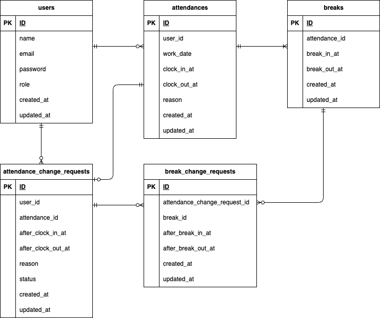

# coachtech勤怠管理アプリ

## 開発環境
### Dockerビルド
1. `git clone https://github.com/TAKAHASHI-Saya/attendance_app.git`
2. DockerDesktopアプリを立ち上げる
3. `docker-compose up -d --build`

### Laravel環境構築
1. `docker-compose exec php bash`
2. `composer install`
3. `cp .env.example .env`
4. .envに以下の環境変数を追加
``` text
DB_CONNECTION=mysql
DB_HOST=mysql
DB_PORT=3306
DB_DATABASE=attendance_db
DB_USERNAME=attendance_user
DB_PASSWORD=attendance_pass
```
5. アプリケーションキーの作成
``` bash
php artisan key:generate
```
6. マイグレーションの実行
``` bash
php artisan migrate
```
7. シーディングの実行
``` bash
php artisan db:seed
```
## テストユーザー
本アプリのテストユーザーとして、2人分用意しています。
ログイン情報は以下の通りです。

**テストユーザー①**
・管理者ユーザー
- メールアドレス：admin@example.com
- パスワード：admin12345678

**テストユーザー②**
・一般ユーザー
- メールアドレス：user@example.com
- パスワード：user12345678

## メール認証機能（Mailhog）
1. .envに以下の環境変数を追加
``` text
MAIL_MAILER=smtp
MAIL_HOST=mailhog
MAIL_PORT=1025
MAIL_USERNAME=null
MAIL_PASSWORD=null
MAIL_ENCRYPTION=null
MAIL_FROM_ADDRESS=no-reply@example.com
MAIL_FROM_NAME="${APP_NAME}"
```
2. メール認証を送信後、以下のサイトにアクセスして認証を実行
- Mailhogのポート：http://localhost:8025/

## テストケース
1. MySQLコンテナにログインし、テスト用データベースを作成
``` bash
CREATE DATABASE demo_test;
```
2. PHPコンテナで、テスト用アプリケーションキーを作成
``` bash
php artisan key:generate --env=testing
```
3. `php artisan config:clear`
4. `php artisan migrate --env=testing`
5. テストの実行
``` bash
php artisan test
```

## 使用技術（実行環境）
- Laravel 8.83.29
- PHP 8.1.34
- MySQL 8.0.26
- Mailhog
- Stripe(stripe-php v19.4.1)

## ER図


## URL
- 一般ユーザー会員登録画面：http://localhost/register
- 管理者ログイン画面：http://localhost/admin/login
- phpMyAdmin：http://localhost:8080/